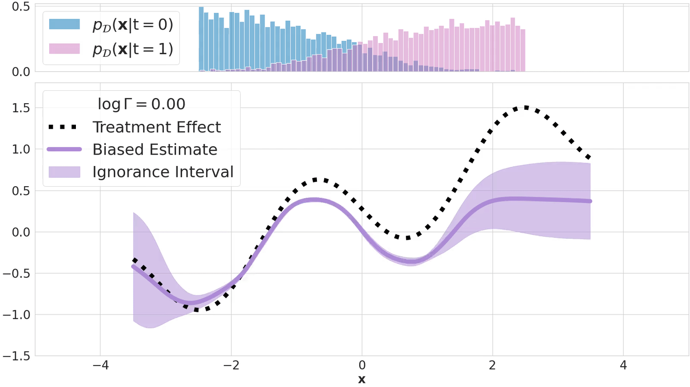

# :pear: quince 

Code for [Quantifying Ignorance in Individual-Level Causal-Effect Estimates under Hidden Confounding](https://arxiv.org/abs/2103.04850)



## :pear: Installation

```.bash
$ git clone git@github.com:anndvision/quince.git
$ cd quince
$ conda env create -f environment.yml
$ conda activate quince
```

[Optional] For developer mode
```.sh
$ pip install -e .
```

## :pear: Example: Replicating IHDP results

### Step 1: Hyperparameter Tuning (optional)

Find the best hyperparameters using the `tune` function, on a dataset like `ihdp` for an `ensemble` model.

```.bash
$ quince \
    tune \
        --job-dir ~/experiments/quince/tuning/ \
        --max-samples 500 \
        --gpu-per-trial 0.2 \
    ihdp \
    ensemble
```

### Step 2: Train ensembles over a number of trials

Here, we use the `train` function to fit an `ensemble` of mixture density networks on 10 realizations of the `ihdp` with hidden confounding dataset. For the full results change `--num-trials 1000`

```.bash
$ quince \
    train \
        --job-dir ~/experiments/quince/ \
        --num-trials 10 \
        --gpu-per-trial 0.2 \
    ihdp \
    ensemble \
        --dim-hidden 200 \
        --num-components 5 \
        --depth 4 \
        --negative-slope 0.3 \
        --dropout-rate 0.5 \
        --spectral-norm 6.0 \
        --learning-rate 5e-4 \
        --batch-size 200 \
        --epochs 500 \
        --ensemble-size 10

```

### Step 3: Evaluate

Plots will be written to the `experiment-dir`

```.bash
$ quince \
    evaluate \
        --experiment-dir ~/experiments/quince/ihdp/hc-True_beta-None/ensemble/dh-200_nc-5_dp-4_ns-0.3_dr-0.5_sn-6.0_lr-0.0005_bs-200_ep-500/ \
    compute-intervals \
        --gpu-per-trial 0.2 \
    compute-intervals-kernel \
        --gpu-per-trial 0.2 \
    plot-deferral \
    plot-errorbars \
        --trial 0
```

## :pear: Replicating Other Results

### Simulated Data

```.bash
$ quince \
    train \
        --job-dir ~/experiments/quince/ \
        --num-trials 50 \
        --gpu-per-trial 0.2 \
    synthetic \
        --gamma-star 1.65 \
    ensemble \
        --dim-hidden 200 \
        --num-components 5 \
        --depth 4 \
        --negative-slope 0.0 \
        --dropout-rate 0.1 \
        --spectral-norm 6.0 \
        --learning-rate 1e-3 \
        --batch-size 32 \
        --epochs 500 \
        --ensemble-size 10

```

```.bash
$ quince \
    evaluate \
        --experiment-dir ~/experiments/quince/synthetic/ne-1000_gs-1.65_th-4.00_be-0.75_si-1.00_dl-2.00/ensemble/dh-200_nc-5_dp-4_ns-0.0_dr-0.1_sn-6.0_lr-0.001_bs-32_ep-500/ \
    compute-intervals \
        --gpu-per-trial 0.2 \
    compute-intervals-kernel \
        --gpu-per-trial 0.2 \
    plot-ignorance \
    print-summary \
    print-summary-kernel \
    paired-t-test
```

Repeat the above for `--gamma-star 2.72` and `--gamma-star 4.48`.

### HCMNIST

```.bash
$ quince \
    train \
        --job-dir ~/experiments/quince/ \
        --num-trials 20 \
        --gpu-per-trial 0.5 \
    hcmnist \
        --gamma-star 1.65 \
    ensemble \
        --dim-hidden 200 \
        --num-components 5 \
        --depth 2 \
        --negative-slope 0.0 \
        --dropout-rate 0.15 \
        --spectral-norm 3.0 \
        --learning-rate 5e-4 \
        --batch-size 200 \
        --epochs 500 \
        --ensemble-size 5

```

```.bash
$ quince \
    evaluate \
        --experiment-dir ~/experiments/quince/hcmnist/gs-1.65_th-4.00_be-0.75_si-1.00_dl-2.00/ensemble/dh-200_nc-5_dp-2_ns-0.0_dr-0.15_sn-3.0_lr-0.0005_bs-200_ep-500/ \
    compute-intervals \
        --gpu-per-trial 1.0 \
    print-summary
```

Repeat the above for `--gamma-star 2.72` and `--gamma-star 4.48`.

## Citation

If you find this code helpful for your work, please cite our paper
[Paper](http://proceedings.mlr.press/v139/jesson21a.html) as

```bibtex
@InProceedings{jesson2021quantifying,
  title={Quantifying Ignorance in Individual-Level Causal-Effect Estimates under Hidden Confounding},
  author={Jesson, Andrew and Mindermann, S{\"o}ren and Gal, Yarin and Shalit, Uri},
  booktitle={Proceedings of the 38th International Conference on Machine Learning},
  pages={4829--4838},
  year={2021},
  editor={Meila, Marina and Zhang, Tong},
  volume={139},
  series={Proceedings of Machine Learning Research},
  month={18--24 Jul},
  publisher={PMLR},
  pdf={http://proceedings.mlr.press/v139/jesson21a/jesson21a.pdf},
  url={https://proceedings.mlr.press/v139/jesson21a.html},
  abstract={We study the problem of learning conditional average treatment effects (CATE) from high-dimensional, observational data with unobserved confounders. Unobserved confounders introduce ignorance—a level of unidentifiability—about an individual’s response to treatment by inducing bias in CATE estimates. We present a new parametric interval estimator suited for high-dimensional data, that estimates a range of possible CATE values when given a predefined bound on the level of hidden confounding. Further, previous interval estimators do not account for ignorance about the CATE associated with samples that may be underrepresented in the original study, or samples that violate the overlap assumption. Our interval estimator also incorporates model uncertainty so that practitioners can be made aware of such out-of-distribution data. We prove that our estimator converges to tight bounds on CATE when there may be unobserved confounding and assess it using semi-synthetic, high-dimensional datasets.}
}
```
